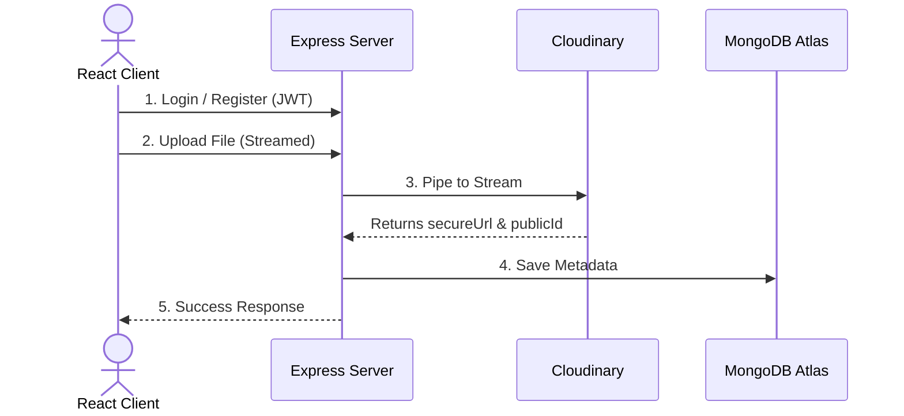
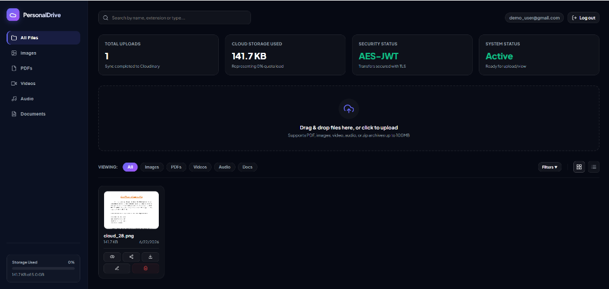
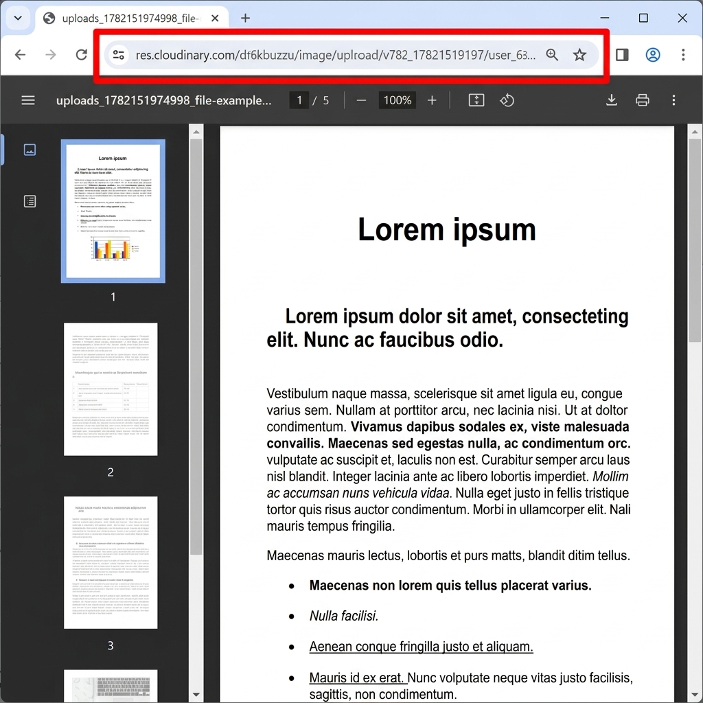

# Personal Cloud Drive (Cloudinary + MongoDB Atlas)

A secure, responsive cloud storage application built on React, Node/Express, MongoDB, and Cloudinary. It provides authenticated users with a personalized workspace to upload, manage, preview, and share files.



---

## ⚡ Features

- **User Authentication**: Secure JWT-based registration, login, and protected routes.
- **Isolated Workspace**: Enforced file ownership—users can only access and manage their own files.
- **Multi-Format Uploads**: Support for images, PDFs, videos, audio, and documents.
- **Progress Tracking**: Real-time concurrent uploading status and progress percentages.
- **File Management**: Responsive Grid & List view layout toggles, collapsible filters, inline renaming, and double-click delete confirmations.
- **Media Previews**: Backdrop-filtered modal preview players for images, inline PDF reader frames, audio, and video files.
- **Secure File Sharing**: One-click public share link generation with an unauthenticated public viewing/download page.
- **Forced Downloads**: Customized download helper that fetches files as binary blobs to bypass cross-origin restrictions and preserve original filenames.

---

## 🛠️ Tech Stack

- **Frontend**: React.js, Vanilla CSS (Glassmorphism theme), Fetch API
- **Backend**: Node.js, Express.js, Multer (In-memory storage), Bcrypt, jsonwebtoken
- **Cloud Database**: MongoDB Atlas (via Mongoose ODM)
- **Cloud Storage**: Cloudinary (V2 SDK)

---

## 🚀 Quick Start Guide

### 1. Backend Configuration
Create a `.env` file in the `backend/` directory:
```env
PORT=5000
MONGODB_URI=mongodb+srv://...
JWT_SECRET=your_jwt_secret
CLOUDINARY_CLOUD_NAME=your_cloud_name
CLOUDINARY_API_KEY=your_api_key
CLOUDINARY_API_SECRET=your_api_secret
CORS_ORIGIN=http://localhost:5173
```

Start the server:
```bash
cd backend
npm install
npm start
```
*Backend listens at `http://localhost:5000`*

### 2. Frontend Configuration
Create a `.env` file in the `frontend/` directory:
```env
VITE_API_BASE_URL=http://localhost:5000/api
```

Start the client:
```bash
cd frontend
npm install
npm run dev
```
*Frontend listens at `http://localhost:5173`*

---

## 📸 Screenshots

### 1. User Dashboard Portal


### 2. Cloudinary Hosted PDF Preview (Highlighted URL)

